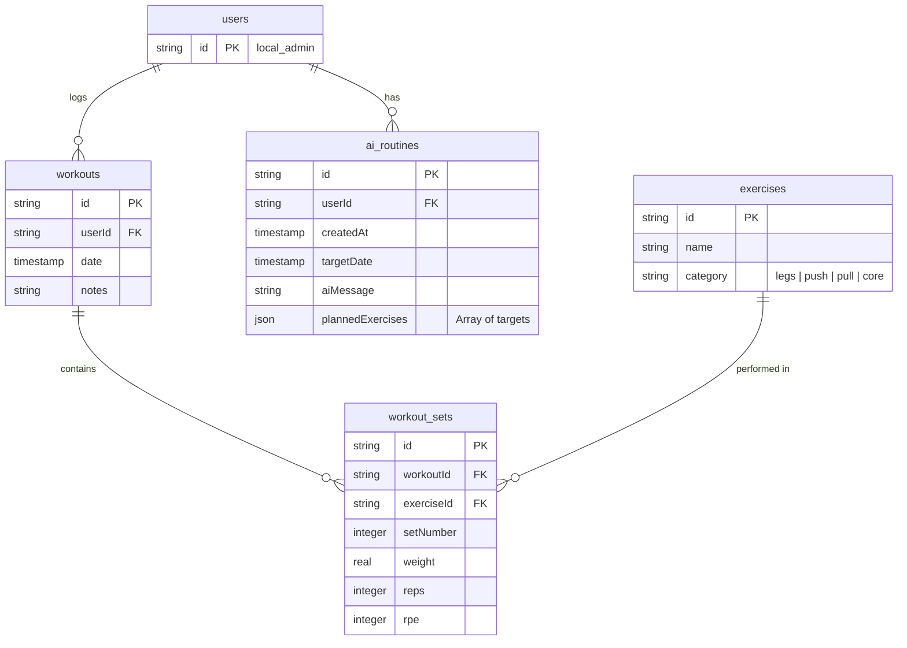

# RepSync (ContextFit) - Architecture Reference

This document outlines the system architecture, boundary contracts, and data flows of RepSync. It is designed to serve as a technical blueprint for implementing features while preserving clean separation of concerns between visual interfaces and AI agents.

---

## 🧭 Core Architectural Pillars

### 1. UI/AI Decoupling
Visual interfaces (React dashboard) and cognitive engines (Claude Desktop) are treated as **separate clients** accessing the same backend REST API. 
*   **The UI Client** focuses on quick manual entry, high-density visualization, and workout tracking.
*   **The AI Client** focuses on historical workout analysis, volume tracking, and programming next routines.
*   Neither client knows the other exists. They communicate asynchronously via changes in the shared state (the database).

### 2. Single Source of Validation (REST API Gateway)
To prevent duplicated logic and data corruption, all database read/write actions must go through the **Fastify API Server**. 
*   The MCP Server acts strictly as a transport gateway. It translates JSON-RPC requests from Claude into standard HTTP requests against the Fastify API.
*   This ensures that calculations (e.g. workout volume), validations (e.g. proper exercise IDs), and eventual authentication rules are written exactly once inside [server.ts](file:///home/node/workspace/apps/api/src/server.ts).

### 3. Asynchronous Sync via Focus States
Since the AI agent modifies the database out-of-band (e.g. in Claude Desktop), the visual web client must synchronize smoothly. We use **TanStack Query**'s automatic `refetchOnWindowFocus` capability. When the user toggles back to the browser window after talking to the AI, the dashboard automatically syncs without requiring a page reload.

---

## 📊 Database Schema & Relations

Managed inside the [@repsync/db](file:///home/node/workspace/packages/db) package, the relational schema defines five core entities:



---

## 🔄 Sequence Flows

### 1. Reading Workouts & Recommending Routines (Local Dev / Stdio)

```mermaid
sequenceDiagram
    actor User
    participant Claude as Claude Desktop
    participant MCP as MCP Server (mcp.ts)
    participant Fastify as Fastify Server (server.ts)
    database DB as SQLite (local.db)

    User->>Claude: "Recommend a workout based on my last session"
    Claude->>MCP: Call tool: `get_recent_workouts` (Stdio)
    MCP->>Fastify: GET /api/workouts (HTTP)
    Fastify->>DB: Query workouts + sets (Drizzle)
    DB-->>Fastify: Return workout history
    Fastify-->>MCP: Return JSON list
    MCP-->>Claude: Return tool result (JSON-RPC)
    Note over Claude: Analyze historical volume, RPE,<br/>and design the next routine
    Claude->>MCP: Call tool: `generate_routine` (aiMessage, plannedExercises)
    MCP->>Fastify: POST /api/routines (HTTP)
    Fastify->>DB: Insert new ai_routine row
    DB-->>Fastify: Confirm insert
    Fastify-->>MCP: 201 Created
    MCP-->>Claude: Return success status
    Claude-->>User: "I've structured a new Leg Day routine for you!"
```

### 2. Auto-Syncing the React Web App

```mermaid
sequenceDiagram
    actor User
    participant Browser as React App (apps/web)
    participant Fastify as Fastify Server
    database DB as SQLite

    Note over User: User switches focus from Claude to the Web Browser
    Browser->>Browser: Trigger window-focus refetch (React Query)
    Browser->>Fastify: GET /api/routines/latest
    Fastify->>DB: Query newest ai_routines row
    DB-->>Fastify: Return Leg Day routine
    Fastify-->>Browser: Return Leg Day JSON
    Browser-->>User: Visual log cards update to display the Leg Day routine
```

---

## 🛠️ Decoupled Tools & HTTP Transport Mapping

To ensure we can shift from Stdio to SSE seamlessly, the MCP server [mcp.ts](file:///home/node/workspace/apps/api/src/mcp.ts) handles only the JSON-RPC interface and maps it directly to HTTP calls.

| MCP Tool | HTTP Method | Fastify Endpoint | Description |
| :--- | :--- | :--- | :--- |
| `get_recent_workouts` | `GET` | `/api/workouts` | Fetches the recent workouts along with their nested sets. |
| `generate_routine` | `POST` | `/api/routines` | Submits a new AI-planned routine to the user's schedule. |

When transitioning to SSE in production, the standalone `mcp.ts` is deleted, and these same tool schemas and validation parameters are registered inside Fastify to handle incoming SSE connection events.
