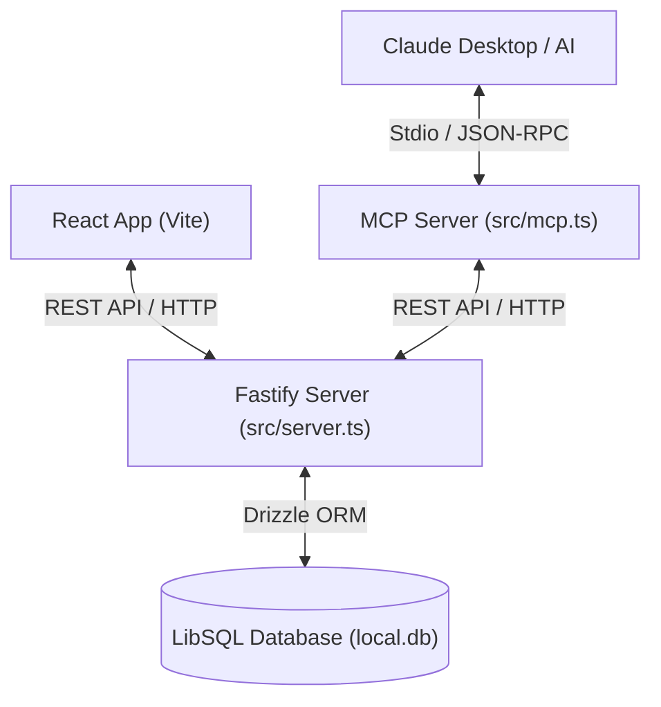
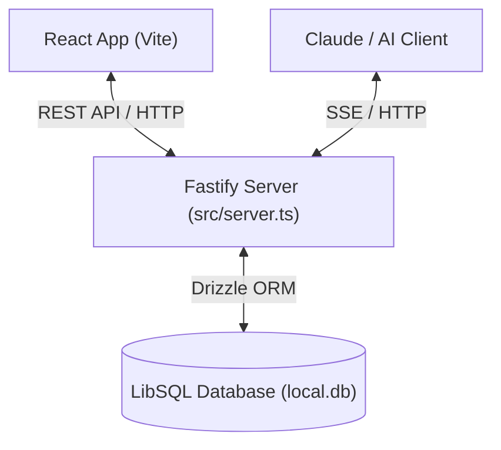

# RepSync (ContextFit) - Project Blueprint

A local-first fitness tracker where application data and user interfaces are decoupled from AI logic. The web application serves as a visual logging dashboard, while an AI assistant (via MCP) interacts with the Fastify API to design workout routines.

---

## 🏗️ Architecture

### Local Development Flow (Stdio)
For local development, Claude Desktop connects via standard input/output (Stdio) to a standalone MCP server process. The MCP tools communicate with the Fastify API to read and write data, preserving the API as the single source of truth.



### Production / SaaS Flow (SSE)
In production, the exact same MCP tool definitions will be exposed via Server-Sent Events (SSE) hosted directly within the Fastify server, allowing remote AI clients to connect via Web HTTP endpoints.



---

## 💻 Tech Stack

### Monorepo & Build System
- **PackageManager:** `pnpm` (Workspace layout)
- **Build & Pipelines:** `Turborepo` (configured in `turbo.json`)
- **Shared Code:** `@repsync/db` (shared database schema & connection) and `@repsync/config` (shared ESLint/TS configs)

### Backend API (`apps/api`)
- **Runtime & Web Framework:** Node.js + Fastify (running via `tsx` watch mode in development)
- **AI Protocol:** Model Context Protocol (MCP) using `@modelcontextprotocol/sdk` (running over Stdio for local dev, SSE planned for production)
- **Authentication:** Bypassed for initial build using `local_admin` as the default user ID.

### Frontend Dashboard (`apps/web`)
- **Framework:** React 19 + TypeScript + Vite 8
- **Data Querying:** TanStack React Query v5 (caches, queries, and auto-refetches on window focus)
- **HTTP Client:** Axios

### Database Package (`packages/db`)
- **Engine:** Turso / LibSQL (running locally as `file:local.db` for zero-configuration setup)
- **ORM:** Drizzle ORM (type-safe queries and relational definitions)
- **Migration Tooling:** Drizzle Kit for generating and running schema migrations

---

## 🛠️ Execution Entry Points

### 1. Web REST API
- **Command:** `pnpm --filter @repsync/api run dev` (runs `src/server.ts`)
- **Purpose:** Exposes HTTP endpoints for the React dashboard.
- **Port:** `3001`

### 2. Standalone MCP Server
- **Command:** `pnpm --filter @repsync/api run dev:mcp` (runs `src/mcp.ts`)
- **Purpose:** Connects to Claude Desktop via stdio for local development.

---

## 🔗 Claude Desktop MCP Configuration

To register the RepSync local MCP server in Claude Desktop, add the following to your `claude_desktop_config.json`:

```json
{
  "mcpServers": {
    "repsync-mcp": {
      "command": "node",
      "args": [
        "-r",
        "tsx/register",
        "/absolute/path/to/workspace/apps/api/src/mcp.ts"
      ],
      "env": {
        "DATABASE_URL": "file:/absolute/path/to/workspace/apps/api/local.db"
      }
    }
  }
}
```

---

## 🚦 Next Development Steps

1. **Fix Compile Errors:** Ensure clean imports and correct dependencies in `apps/api`.
2. **Implement API endpoints for MCP:** Add endpoints inside [server.ts](file:///home/node/workspace/apps/api/src/server.ts) to handle reads/writes for the MCP tools (e.g. retrieving workouts and logging routines).
3. **Connect MCP to API:** Refactor [mcp.ts](file:///home/node/workspace/apps/api/src/mcp.ts) to fetch data from the Fastify API using `fetch` or `axios` rather than querying the database directly.
4. **Database Seeding:** Populate `exercises` with a default seed list.
5. **Implement UI:** Build out the React dashboard to display log cards and log new workouts.
